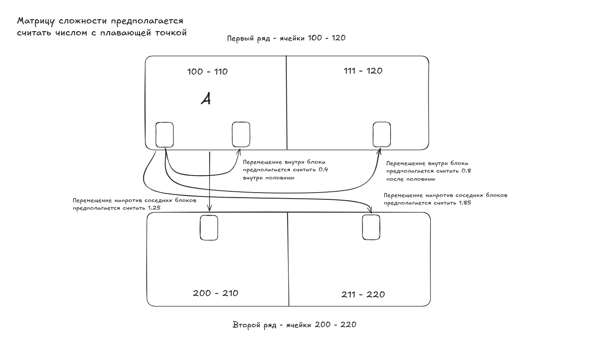
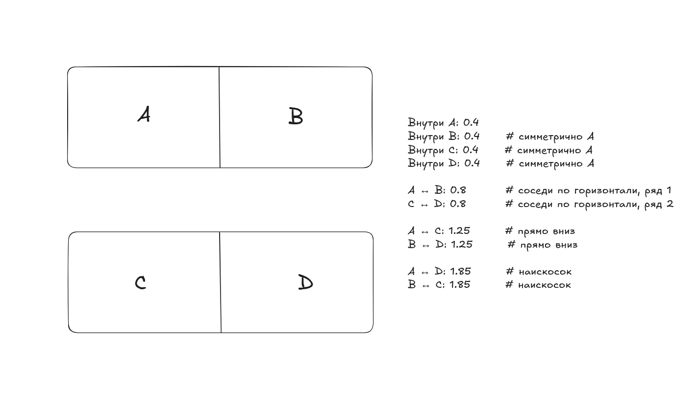

# Intelligent Space Clearing System v0.1

# Система интеллектуального освобождения ячеек склада для водителей погрузчиков.




---

**Проблема:** водитель не знает куда везти остаток из ячейки — слезает, осматривает соседние ячейки, ищет место, часто ошибается. Холостые пробеги, потеря времени.

**Решение:** водитель выбирает диапазон ячеек для освобождения — система анализирует склад и выдаёт оптимальный пошаговый маршрут. Что взять, куда везти, в какой последовательности.

---

## Как запустить

```bash
cd intelligent-space-clearing-system/
cd iscs/
python engine.py
```

Выберите сценарий, введите диапазон ячеек (нажмите Enter) — система выведет маршрут.

---

## Структура проекта

```
intelligent-space-clearing-system/
├── models/
│   ├── eo.py            # модель паллета (ЕО)
│   ├── cell.py          # модель ячейки
│   ├── matrix.py        # матрица сложности маршрутов
│   └── __init__.py
├── algorithm.py         # логика выбора оптимальной ячейки и маршрута
├── engine.py            # точка входа, терминальный интерфейс
├── generator_utils.py   # общие утилиты для генераторов
├── generator_1.py       # тестовый сценарий 1
├── generator_2.py       # тестовый сценарий 2
└── requirements.txt
```

---

## Матрица сложности

Склад разбит на 4 блока. Сложность маршрута зависит от того между какими блоками выполняется перемещение:

```
Блок A: P100–P110    Блок B: P111–P120
Блок C: P200–P210    Блок D: P211–P220
```

Формула: `сложность × количество ЕО = очки`

Алгоритм выбирает маршрут с минимальными очками.

---

## Тестовые сценарии

**Сценарий 1** — диапазон P100–P120
- Оптимальный источник: P105 (5 паллетов)
- Оптимальная цель: P108 (свободно 10 мест, тот же продукт)
- Ожидаемый результат: 5 ЕО из P105 → P108, 2.0 очка

**Сценарий 2** — диапазон P200–P220
- Оптимальный источник: P213 (8 паллетов)
- Оптимальная цель: P116 (свободно 9 мест, тот же продукт, блок B)
- Ожидаемый результат: 8 ЕО из P213 → P116, 10.0 очков

---

## Правила алгоритма

- Целевая ячейка ищется по всему складу — не только внутри диапазона
- В целевую ячейку можно ставить только тот же продукт что стоит в ней, если она не пустая
- Заблокированные ячейки исключаются
- Выбирается маршрут с минимальной суммой очков сложности

## Что будет дорабатываться

**Алгоритм**
- Многошаговый маршрут — сейчас один шаг, в реальности иногда нужно сначала освободить место в целевой ячейке, потом везти основной остаток
- Групповая оптимизация — освободить сразу несколько ячеек диапазона за один обход с минимальными суммарными очками
- Освобождение к месту отгрузки — приоритетное перемещение ЕО напрямую к воротам отгрузки (R01, DA07 и др.)
- Учёт зарезервированных ЕО - зарезервированные паллеты не участвуют в перемещении
- Вариативность планов — система предлагает несколько вариантов маршрута по возрастанию сложности (43 → 49 → 56 очков). Водитель выбирает сам: оптимальный по очкам не всегда оптимальный физически — узкий проезд, неудобный подъезд, соображения безопасности

**Надёжность**
- Конкурентный доступ — блокировка ячейки на время выполнения задания, два водителя не берут одну ячейку одновременно
- Автообновление плана — если ЕО участвующие в активном плане были перемещены другим водителем, план пересчитывается автоматически
- Актуальность анализа — план помечается устаревшим через заданный интервал времени

**Настройка и управление**
- Динамическая матрица сложности — значения настраиваются через интерфейс без изменения кода, утверждаются начальником смены
- Удобный UI управления ячейками — открыть/закрыть ячейку с указанием причины, журнал изменений, мониторинг долго закрытых ячеек
- Интерфейс настройки матрицы для начальника смены — полный CRUD

**Масштабирование**
- Поддержка полного склада — расширение матрицы на все ряды и зоны завода
- Асинхронный анализ — параллельный перебор кандидатов при росте склада до 300+ ячеек и 5000+ ЕО
- Интеграция с SAP режим 2.2-3030
- Мультизаводность* пока что не ясна применимость — общая платформа с локальными матрицами под каждый завод группы Напитки вместе

---

## MVP

На первом этапе система выводит маршрут на экран.
Водитель фотографирует и выполняет вручную через режим 2.2-3030.
Без интеграции с SAP.

Цель MVP — проверить качество алгоритма и точность матрицы сложности на реальном складе.